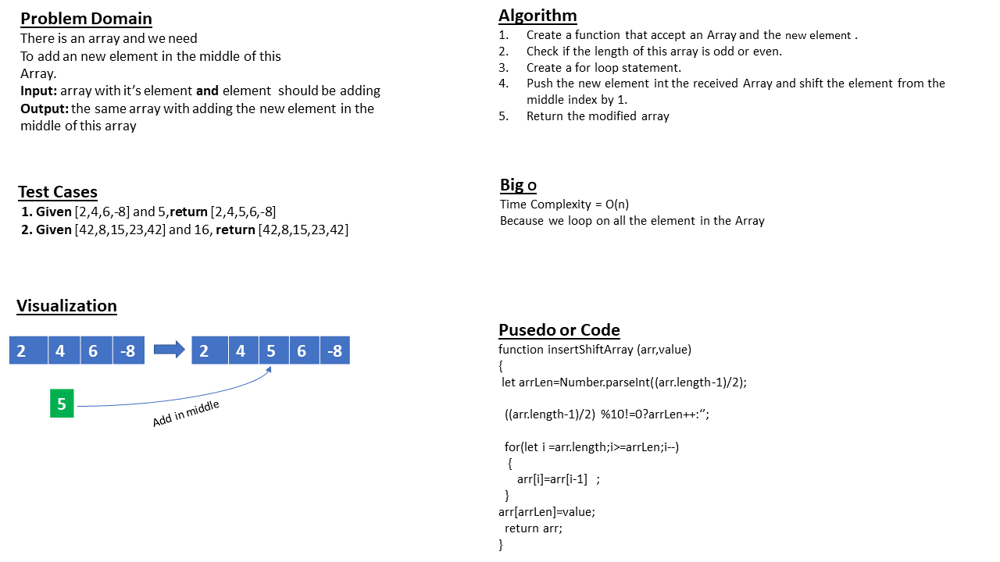

# Insert and shift an array in middle at index

## **Whiteboard Process**

## **Approach & Efficiency**

## **Solution**

[Code-Link](https://replit.com/@Malek-SHSH/testing#index.js)

#### ***function insertShiftArray(arr,value){***

 #### ***let arrMidLen=Number.parseInt((arr.length-1)/2);***
 #### ***((arr.length-1)/2) %10!=0?arrMidLen++:'';***
 #### ***for(let i =arr.length;i>=arrMidLen;i--)***
 ####   ***{***
  ####    ***arr[i]=arr[i-1]***
  ####  ***}***
  #### ***arr[arrMidLen]=value***
 #### ***return arr***
#### ***}***

---------------------------------------------
| ***Input***       | ***Output*** |
| ----------- | ----------- |
| _[2 , 4 , 6 , -8] , 5_     | _[2 , 4 , 5 , 6 , -8]_       |
| _[42 , 8 , 15 , 23 , 42], 16_  | _[42 , 8 , 15 , 16  , 23 , 42]_       |

