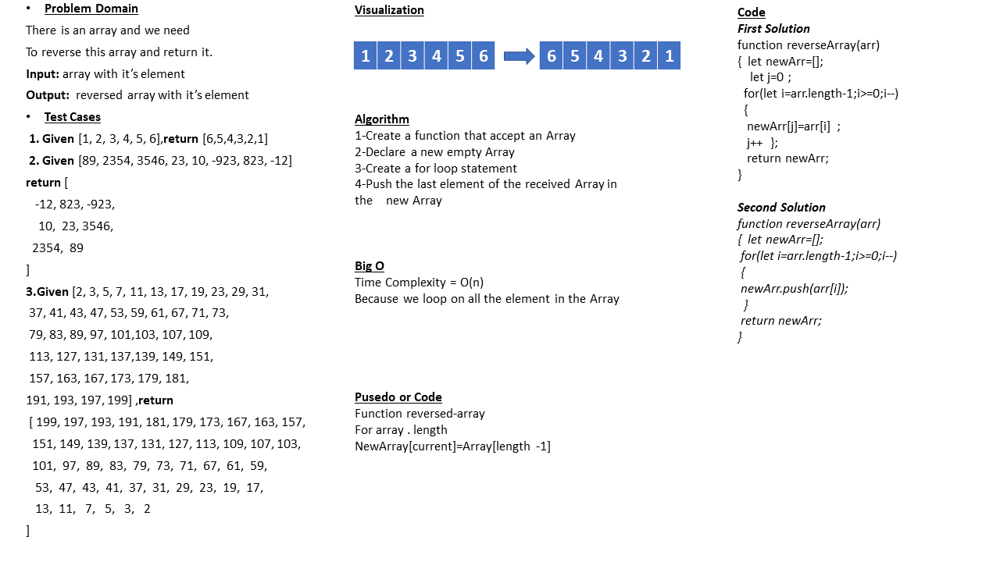

# Reverse an array

## Whiteboard Process

## Approach & Efficiency

forloop

## Solution

**_First Soluition_**

#### function reverseArray(arr){

#### let newArr=[];

#### let j=0;

#### for(let i=arr.length-1;i>=0;i--)

#### {

#### newArr[j]=arr[i];

#### j++;

#### }

#### return newArr;

#### }

**_Second Soluition_**

#### function reverseArray(arr){

#### let newArr=[];

#### for(let i=arr.length-1;i>=0;i--)

#### {

#### newArr.push(arr[i])

#### }

#### return newArr

#### }

---------------------------------------------
| ***Input***       | ***Output*** |
| ----------- | ----------- |
| [1, 2, 3, 4, 5, 6]      | [ 6, 5, 4, 3, 2, 1 ]       |
| [89, 2354, 3546, 23, 10, -923, 823, -12]   | [-12, 823, -923,10,  23, 3546,2354,  89]        |
| [2, 3, 5, 7, 11, 13, 17, 19, 23, 29, 31, 37, 41, 43, 47, 53, 59, 61, 67, 71, 73, 79, 83, 89, 97, 101, 103, 107, 109, 113, 127, 131, 137, 139, 149, 151, 157, 163, 167, 173, 179, 181, 191, 193, 197, 199] | [199, 197, 193, 191, 181, 179, 173, 167, 163, 157,151, 149, 139, 137, 131, 127, 113, 109, 107, 103, 101,  97,  89,  83,  79,  73,  71,  67,  61,  59, 53,  47,  43,  41,  37,  31,  29,  23,  19,  17,13,  11,   7,   5,   3,   2]        |

