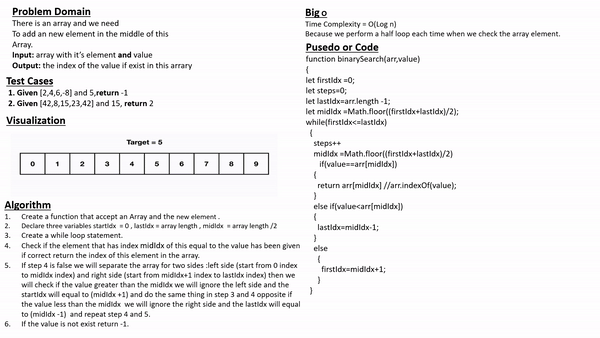

# Binary search in a sorted 1D array

## **Whiteboard Process**



## **Approach & Efficiency**
Improving performance and the Time complexity for the code from O(n) => O(Log n)

## **Solution**

[Code-Link](https://replit.com/@Malek-SHSH/binarySearch#index.js)

***Code:***
 ```javascript
 function binarySearch(arr,value)
{
let firstIdx =0;
//let steps=0;
let lastIdx=arr.length -1;
let midIdx =Math.floor((firstIdx+lastIdx)/2);
while(firstIdx<=lastIdx)
  {
    //steps++
    midIdx =Math.floor((firstIdx+lastIdx)/2)
       if(value==arr[midIdx])
    {
      return arr[midIdx] //arr.indexOf(value);
    }
    else if(value<arr[midIdx])
    {
      lastIdx=midIdx-1;
    }
    else
      {
        firstIdx=midIdx+1;
      }
  }
return -1;
}

let arr=[4, 8, 15, 16, 23, 42]
  let value=15
console.log(binarySearch(arr,value))
let arr1=[-131, -82, 0, 27, 42, 68, 179]
  let value1=42
console.log(binarySearch(arr1,value1))
let arr2=[11, 22, 33, 44, 55, 66, 77]
  let value2=90
console.log(binarySearch(arr2,value2))
let arr3=[1, 2, 3, 5, 6, 7]
  let value3=4
console.log(binarySearch(arr3,value3))

 ```

 ***Output:***
````javascript
2
4
-1
-1
````
