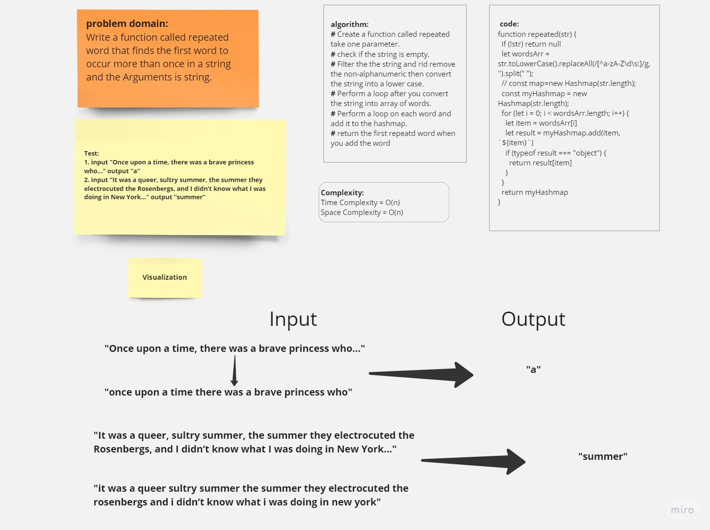

# hashmap-repeated-word

## **Whiteboard Process**




## **Solution**

[hashmap-repeated-word](https://replit.com/@Malek-SHSH/repeatedHashTable)

### Node Class Code :

```javascript
"use strict";
class Node {
  constructor(value) {
    this.value = value;
    this.next = null;
  }
}
module.exports = Node;
```

### LinkedList Class Code :

```javascript
class Node {
  constructor(value) {
    this.value = value;
    this.next = null;
  }
}
class LinkedList {
  constructor() {
    this.head = null;
  }
  append(value) {
    const node = new Node(value);
    if (!this.head) {
      this.head = node;
      return;
    }
    let current = this.head;
    while (current.next) {
      current = current.next;
    }
    current.next = node;
  }
  // returning the all the values  from the linkedList
  print() {
    let values = [];
    let current = this.head;
    while (current) {
      values.push(current.value);
      current = current.next;
    }
    return values;
  }
}
class Hashmap {
  constructor(size) {
    this.size = size;
    this.map = new Array(size);
  }
  makeHash(key) {
    const asciiCodeSum = key.split("").reduce((acc, char) => {
      return acc + char.charCodeAt();
    }, 0);
    const multiPrime = asciiCodeSum * 599;
    const theIndex = multiPrime % this.size;
    return theIndex;
  }
  add(key, value) {
    const hash = this.makeHash(key);
    if (!this.map[hash]) {
      this.map[hash] = new LinkedList();
    }
    else {
      this.map[hash].append({ [key]: value })
      return { [key]: value }
    }
  }
}

function repeated(str) {
  if (!str) return null
  let wordsArr = str.toLowerCase().replaceAll(/[^a-zA-Z\d\s:]/g, '').split(" ");
  // const map=new Hashmap(str.length);
  const myHashmap = new Hashmap(str.length);
  for (let i = 0; i < wordsArr.length; i++) {
    let item = wordsArr[i]
    let result = myHashmap.add(item, `${item}`)
    if (typeof result === "object") {
      return result[item]
    }
  }
  return myHashmap
}

let str = "Once upon a time, there was a brave princess who..."
let str2 = "It was the best of times, it was the worst of times, it was the age of wisdom, it was the age of foolishness, it was the epoch of belief, it was the epoch of incredulity, it was the season of Light, it was the season of Darkness, it was the spring of hope, it was the winter of despair, we had everything before us, we had nothing before us, we were all going direct to Heaven, we were all going direct the other way – in short, the period was so far like the present period, that some of its noisiest authorities insisted on its being received, for good or for evil, in the superlative degree of comparison only..."
let str3 = "It was a queer, sultry summer, the summer they electrocuted the Rosenbergs, and I didn’t know what I was doing in New York..."

console.log(repeated(str))
console.log(repeated(str2))
console.log(repeated(str3))

```
***output***

```javascript
a
it
summer
```
