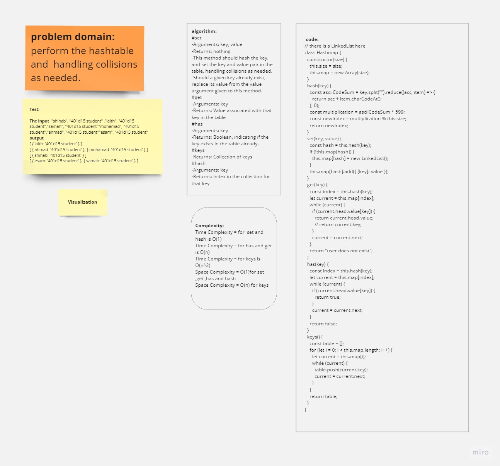

# HashTable

## **Whiteboard Process**




## **Approach & Efficiency**


-


## **Solution**

```js
"use strict";
class Node {
  constructor(value) {
    this.value = value;
    this.next = null;
  }
}
class LinkedList {
  constructor() {
    this.head = null;
  }
  add(value) {
    const node = new Node(value);
    if (!this.head) {
      this.head = node;
      return;
    }
    let current = this.head;
    while (current.next) {
      current = current.next;
    }
    current.next = node;
  }
  // returning the all the values  from the linkedList
  print() {
    let values = [];
    let current = this.head;
    while (current) {
      values.push(current.value);
      current = current.next;
    }
    return values;
  }
}
class Hashmap {
  constructor(size) {
    this.size = size;
    this.map = new Array(size);
  }
  hash(key) {
    const asciiCodeSum = key.split("").reduce((acc, item) => {
      return acc + item.charCodeAt();
    }, 0);
    const multiplication = asciiCodeSum * 599;
    const newIndex = multiplication % this.size;
    return newIndex;
  }
  set(key, value) {
    const hash = this.hash(key);
    if (!this.map[hash]) {
      this.map[hash] = new LinkedList();
    }

    this.map[hash].add({ [key]: value });
  }
  get(key) {
    const index = this.hash(key);
    let current = this.map[index];
    while (current) {
      if (current.head.value[key]) {
        return current.head.value;
        // return current.key;
      }
      current = current.next;
    }
    return "user does not exist";
  }
  has(key) {
    const index = this.hash(key);
    let current = this.map[index];
    while (current) {
      if (current.head.value[key]) {
        return true;
      }
      current = current.next;
    }
    return false;
  }
  keys() {
    const table = [];
    for (let i = 0; i < this.map.length; i++) {
      let current = this.map[i];
      while (current) {
        table.push(current.key);
        current = current.next;
      }
    }
    return table;
  }
}
const myHashmap = new Hashmap(10);

myHashmap.set("esam", "401d15 student");
myHashmap.set("ahmad", "401d15 student");
myHashmap.set("mohamad", "401d15 student");
myHashmap.set("samah", "401d15 student");
myHashmap.set("laith", "401d15 student");
myHashmap.set("shihab", "401d15 student");
// myHashmap.map.forEach((ll) => {
//   console.log(ll.print());
// })

// console.log(myHashmap.has("esam"));
```
