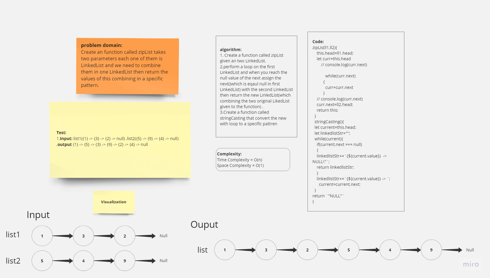

# linked-list-zipList

## **Whiteboard Process**




## **Approach & Efficiency**

1. ### Data Structure:

- Linked lists are linear data structures composed of nodes. Each node contains a value and a reference (or link) to the next node in the list.
- The first node is called the head, and the last node is called the tail. The tail node points to null, indicating the end of the list.

2. ### Accessing Elements:

- Unlike arrays, accessing elements in a linked list is not as efficient. To access a specific element, you need to traverse the list from the head node until you reach the desired node.
- The time complexity for accessing an element in a linked list is O(n), where n is the number of nodes.

3. ### Insertion and Deletion :

- Insertion and deletion operations can be efficient in linked lists, especially when adding or removing elements at the beginning or end of the list.
- Inserting a new node at the beginning (changing the head) or removing the first node takes constant time complexity, O(1).
  Insertion or deletion in the middle of the list requires traversing to the specific position, resulting in a time complexity of O(n), where n is the number of nodes.

4. ### Memory Allocation:

- Linked lists dynamically allocate memory for each node, allowing flexibility in terms of adding or removing nodes.
- However, linked lists use more memory than arrays because they need to store the value and the reference to the next node.

5. ### Advantages and Disadvantages:

- Linked lists are beneficial when frequent insertions or deletions are required, particularly at the beginning or end of the list.
- They can dynamically grow or shrink based on needs without requiring expensive resizing operations.
- However, linked lists have slower access times compared to arrays and have higher memory overhead due to the additional memory required for storing references.

## **Solution**

[zipList-Code-Link](https://replit.com/@Malek-SHSH/zip-two-linked-lists)

### Node Class Code :

```javascript
"use strict";
class Node {
  constructor(value) {
    this.value = value;
    this.next = null;
  }
}
module.exports = Node;
```

### LinkedList Class Code :

```javascript
const Node=require("./node");
class LinkedList{
  constructor(){
    this.head=null;
    this.counter=null;
  }
append(value){
  let newNode=new Node(value);
  if(!this.head){
    this.head=newNode;
    this.counter=0;
    return this;
  }
  let curr=this.head;
  while(curr.next)
    {
        curr=curr.next
    }
  this.counter++;
  curr.next=newNode;
  return this;
}

  zipList(ll1,ll2){
    this.head=ll1.head;
    let curr=this.head
        // console.log(curr.next)

            while(curr.next)
          {
            curr=curr.next
          }
    // console.log(curr.next)
    curr.next=ll2.head;
    return this;
  }
  stringCasting(){
  let current=this.head;
  let linkedlistStr='"';
  while(current){
    if(current.next === null)
    {
    linkedlistStr+=`{${current.value}}  -> NULL\"`;
    return linkedlistStr;
    }
    linkedlistStr+=`{${current.value}} -> `;
      current=current.next;
  }
return `"NULL"`
}
}

module.exports=LinkedList;

```

### Node Class Code :

```javascript
"use strict";
const linkedList=require("./linkedlist");
const ll1=new linkedList();
const ll2=new linkedList();
ll1.append(1)
ll1.append(3)
ll1.append(2)
ll2.append(5)
ll2.append(4)
ll2.append(9)

console.log("**************************************************")
console.log(ll1.zipList(ll1,ll2).stringCasting())
console.log("**************************************************")
```

**_Output :_**

```javascript
**************************************************
"{1} -> {3} -> {2} -> {5} -> {4} -> {9}  -> NULL"
**************************************************

```


