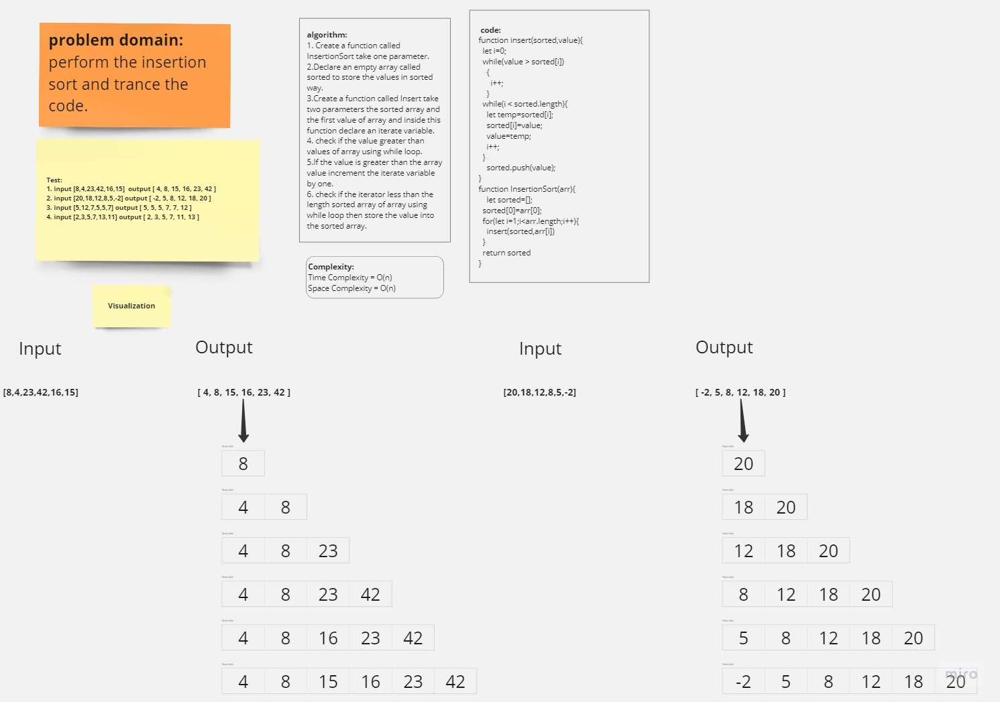

# InsertionSort

## Whiteboard Process



<!-- ## Approach & Efficiency -->


## Solution

```javascript
function insert(sorted,value){
  let i=0;
  while(value > sorted[i])
    {
      i++;
    }
  while(i < sorted.length){
    let temp=sorted[i];
    sorted[i]=value;
    value=temp;
    i++;
  }
    sorted.push(value);
}
function InsertionSort(arr){
    let sorted=[];
  sorted[0]=arr[0];
  for(let i=1;i<arr.length;i++){
    insert(sorted,arr[i])
    // console.log(arr[i])
  }
  return sorted
}

console.log(InsertionSort([8,4,23,42,16,15]))
console.log(InsertionSort([20,18,12,8,5,-2]))
console.log(InsertionSort([5,12,7,5,5,7]))
console.log(InsertionSort([2,3,5,7,13,11]))

```

---------------------------------------------
| ***Input***       | ***Output*** |
| ----------- | ----------- |
| [8,4,23,42,16,15] |  [4,8,15,16,23,42] |
| [20,18,12,8,5,-2] |  [-2,5,8,12,18,20] |
| [5,12,7,5,5,7] |  [5,5,5,7,7,12] |
| [2,3,5,7,13,11] |  [2,3,5,7,11,13] |


