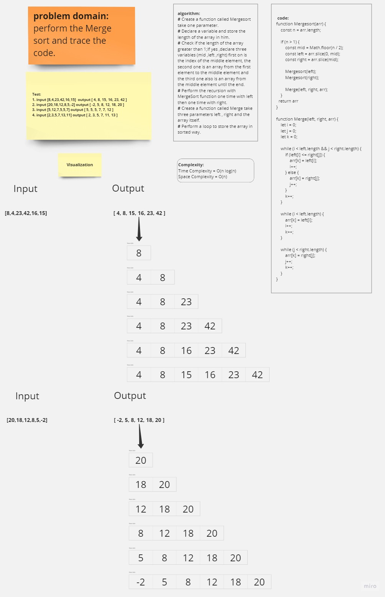

# Merge Sort

## Whiteboard Process



<!-- ## Approach & Efficiency -->


## Solution

```javascript
function Mergesort(arr) {
    const n = arr.length;

    if (n > 1) {
        const mid = Math.floor(n / 2);
        const left = arr.slice(0, mid);
        const right = arr.slice(mid);

        Mergesort(left);
        Mergesort(right);

        Merge(left, right, arr);
    }
  return arr
}

function Merge(left, right, arr) {
    let i = 0;
    let j = 0;
    let k = 0;

    while (i < left.length && j < right.length) {
        if (left[i] <= right[j]) {
            arr[k] = left[i];
            i++;
        } else {
            arr[k] = right[j];
            j++;
        }
        k++;
    }

    while (i < left.length) {
        arr[k] = left[i];
        i++;
        k++;
    }

    while (j < right.length) {
        arr[k] = right[j];
        j++;
        k++;
    }
}
```

---------------------------------------------
| ***Input***       | ***Output*** |
| ----------- | ----------- |
| [8,4,23,42,16,15] |  [4,8,15,16,23,42] |
| [20,18,12,8,5,-2] |  [-2,5,8,12,18,20] |
| [5,12,7,5,5,7] |  [5,5,5,7,7,12] |
| [2,3,5,7,13,11] |  [2,3,5,7,11,13] |


