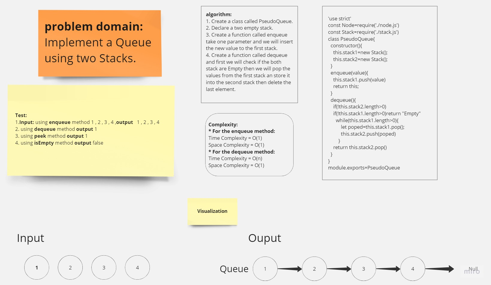

# stack-queue-brackets

## Whiteboard


### Queue-White-Borad



## **Solution**

[stack-queue-brackets-Code-Link](https://replit.com/@Malek-SHSH/stack-queue-brackets#)

### Node Class Code :

```javascript
"use strict";
class Node {
  constructor(value) {
    this.value = value;
    this.next = null;
  }
}
module.exports = Node;
```

### Stack Class Code :

```javascript
'use strict'
const Node=require('./node');
class Stack{
  constructor(){
    this.top=null;
  }
  isEmpty(){
   return !this.top;
  }
  push(value){
    const newNode= new Node(value);
    if(this.isEmpty()){
      this.top=newNode;
      return value;
    }
    newNode.next=this.top;
    this.top=newNode;
    return value;
  }

  pop(){
  const temp=this.top;
  this.top=this.top.next;
  temp.next=null;
  return temp.value;
  }

}
module.exports=Stack
```


### Queue Class Code :

```javascript


```

### index file Code :

```javascript

'use strict'
const Stack=require('./stack');
function arePair( open,  close)
{
	if (open === '(' && close === ')')
		return true;
	else if (open === '{' && close === '}')
		return true;
	else if (open === '[' && close === ']')
		return true;
	return false;
}

function validateBrackets(str){
  const stack=new Stack();
  for(let i=0;i<str.length;i++){
    if(str[i]==='(' ||str[i]==='{' ||str[i]==='[')
    {
      console.log(stack.push(str[i]))
    }
    else if(str[i]===')' ||str[i]==='}' ||str[i]===']')
    {
      if(stack.isEmpty() && !arePair(stack.top.value,str[i]))return false;
      else stack.pop()
    }

  }

return stack.isEmpty()?true:false;
}

console.log(validateBrackets(""))


```

**_Output :_**

```javascript

```

