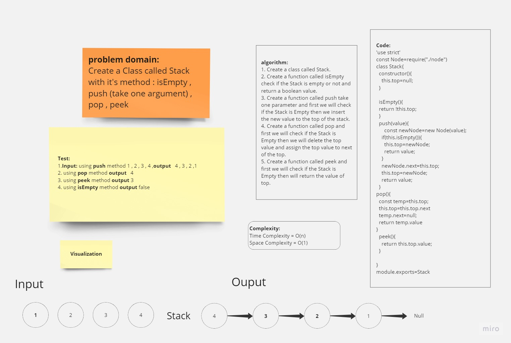
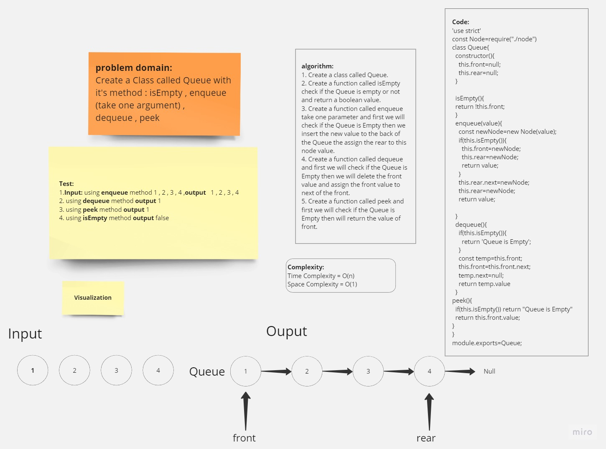

# Stack-Queue

## Whiteboard

### Stack-White-Borad



### Queue-White-Borad



## **Solution**

[Stack-Queue-Code-Link](https://replit.com/@Malek-SHSH/stack-and-queue#index.js)

### Node Class Code :

```javascript
"use strict";
class Node {
  constructor(value) {
    this.value = value;
    this.next = null;
  }
}
module.exports = Node;
```

### Stack Class Code :

```javascript
'use strict'
const Node=require("./node")
class Stack{
  constructor(){
    this.top=null;
  }

  isEmpty(){
  return !this.top;
  }
  push(value){
      const newNode=new Node(value);
    if(this.isEmpty()){
      this.top=newNode;
      return value;
    }
    newNode.next=this.top;
    this.top=newNode;
    return value;
  }
pop(){
  const temp=this.top;
  this.top=this.top.next
  temp.next=null;
  return temp.value
}
  peek(){
    return this.top.value;
  }

}
module.exports=Stack
```


### Queue Class Code :

```javascript
'use strict'
const Node=require("./node")
class Queue{
  constructor(){
    this.front=null;
    this.rear=null;
  }

  isEmpty(){
  return !this.front;
  }
  enqueue(value){
    const newNode=new Node(value);
    if(this.isEmpty()){
      this.front=newNode;
      this.rear=newNode;
      return value;
    }
    this.rear.next=newNode;
    this.rear=newNode;
    return value;

  }
  dequeue(){
    if(this.isEmpty()){
      return 'Queue is Empty';
    }
    const temp=this.front;
    this.front=this.front.next;
    temp.next=null;
    return temp.value
  }
peek(){
  if(this.isEmpty()) return "Queue is Empty"
  return this.front.value;
}


}
module.exports=Queue;
```

### index file Code :

```javascript
'use strict'
const Stack=require("./stack")
const Queue=require("./queue")

const stack= new Stack;

console.log('isEmpty stack method',stack.isEmpty())
console.log('pushed value',stack.push(1))
console.log('pushed value',stack.push(2))
console.log('pushed value',stack.push(3))
console.log('pushed value',stack.push(4))
console.log('pushed value',stack.push(5))
console.log('poped value',stack.pop())
console.log('peek value',stack.peek())
console.log('isEmpty method',stack.isEmpty())
console.log(stack)
console.log('**********************************')
const queue= new Queue;
console.log('isEmpty Queue method',queue.isEmpty())
console.log('enqueue value',queue.enqueue(1))
console.log('enqueue value',queue.enqueue(2))
console.log('enqueue value',queue.enqueue(3))
console.log('enqueue value',queue.enqueue(4))
console.log('enqueue value',queue.enqueue(5))
console.log('dequeue value',queue.dequeue())
console.log('peek value',queue.peek())
console.log('isEmpty Queue method',queue.isEmpty())
console.log(queue)


```

**_Output :_**

```javascript
isEmpty stack method true
pushed value 1
pushed value 2
pushed value 3
pushed value 4
pushed value 5
poped value 5
peek value 4
isEmpty method false
Stack { top: Node { value: 4, next: Node { value: 3, next: [Node] } } }
**********************************
isEmpty Queue method true
enqueue value 1
enqueue value 2
enqueue value 3
enqueue value 4
enqueue value 5
dequeue value 1
peek value 2
isEmpty Queue method false
Queue {
  front: Node { value: 2, next: Node { value: 3, next: [Node] } },
  rear: Node { value: 5, next: null }
      }
```

