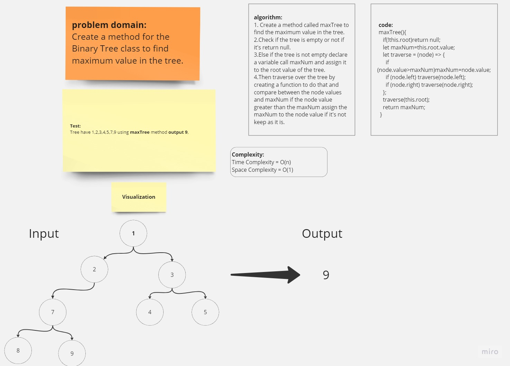

# Implementation: Tree-max

## Whiteboard

### binaryTree-White-Borad



## **Solution**


### Node Class Code :

```javascript
"use strict";
class Node {
  constructor(value) {
    this.value = value;
    this.next = null;
  }
}
module.exports = Node;
```

### binaryTree Class Code :

```javascript
"use strict";
class binaryTree {
  constructor(root) {
    this.root = root;
  }
  preOrder() {
    let result = [];
    let traverse = (node) => {
      result.push(this.node.value);
      if (this.node.left) traverse(node.left);
      if (this.node.right) traverse(node.right);
    };
    traverse(this.root);
    return result;
  }
  inOrder() {
    let result = [];
    let traverse = (node) => {
      if (this.node.left) traverse(node.left);
      result.push(this.node.value);
      if (this.node.right) traverse(node.right);
    };
    traverse(this.root);
    return result;
  }
  postOrder() {
    let result = [];
    let traverse = (node) => {
      if (this.node.left) traverse(node.left);
      if (this.node.right) traverse(node.right);
      result.push(this.node.value);
    };
    traverse(this.root);
    return result;
  }
    maxTree(){
    if(!this.root)return null;
    let maxNum=this.root.value;
    let traverse = (node) => {
      if (node.value>maxNum)maxNum=node.value;
      if (node.left) traverse(node.left);
      if (node.right) traverse(node.right);
    };
    traverse(this.root);
    return maxNum;
  }
}
module.exports = binaryTree;
```

### index file Code :

```javascript
"use strict";
const BinaryTree = require("./binaryTree");
const Node = require("./node");

let tree = null;

let one = new Node(1);
let two = new Node(2);
let three = new Node(3);
let four = new Node(4);
let five = new Node(5);
let six = new Node(6);
let seven = new Node(7);
let eight = new Node(8);
let nine = new Node(9);

one.left = two;
one.right = three;
two.left = six;
three.left = four;
three.right = five;
six.right = seven;
seven.left = eight;
seven.right = nine;

tree = new BinaryTree(one);

let preOrder = tree.preOrder();
let inOrder = tree.inOrder();
let postOrder = tree.postOrder();

console.log("preOrder: ", preOrder);
console.log("inOrder: ", inOrder);
console.log("postOrder: ", postOrder);
```


### index file Code :

```javascript
"use strict";
const BinaryTree = require('./binaryTree');
const Node = require('./node');

let tree = null;

let one = new Node(1);
let two = new Node(2);
let three = new Node(3);
let four = new Node(4);
let five = new Node(5);
let six = new Node(6);
let seven = new Node(7);
let eight = new Node(8);
let nine = new Node(9);

one.left = two;
one.right = three;
two.left = six;
three.left = four;
three.right = five;
six.right = seven;
seven.left = eight;
seven.right = nine;

tree = new BinaryTree(one);

let preOrder = tree.preOrder();
let inOrder = tree.inOrder();
let postOrder = tree.postOrder();
let maxTree = tree.maxTree();

console.log('*********BinaryTree*********')
console.log('preOrder: ', preOrder);
console.log('inOrder: ', inOrder);
console.log('postOrder: ', postOrder);
console.log('maxTree: ', maxTree);

```

**_Output :_**

```javascript
*********BinaryTree*********

preOrder:  [
  1, 2, 6, 7, 8,
  9, 3, 4, 5
]
inOrder:  [
  6, 8, 7, 9, 2,
  1, 4, 3, 5
]
postOrder:  [
  8, 9, 7, 6, 2,
  4, 5, 3, 1
]
maxTree:  11
```
