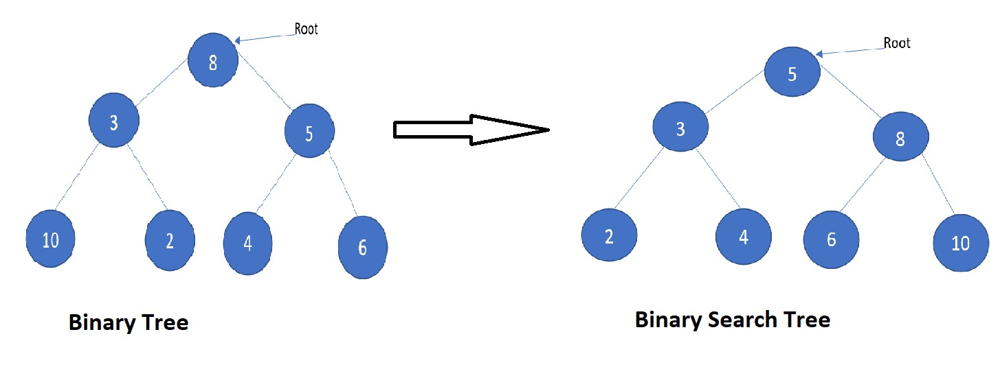

# Implementation: Trees

## Whiteboard

### binaryTree-White-Borad



## **Solution**

[binaryTree-Code-Link](https://codesandbox.io/p/sandbox/clever-scott-446q8v)

### Node Class Code :

```javascript
"use strict";
class Node {
  constructor(value) {
    this.value = value;
    this.next = null;
  }
}
module.exports = Node;
```

### binaryTree Class Code :

```javascript
"use strict";
class binaryTree {
  constructor(root) {
    this.root = root;
  }
  preOrder() {
    let result = [];
    let traverse = (node) => {
      result.push(this.node.value);
      if (this.node.left) traverse(node.left);
      if (this.node.right) traverse(node.right);
    };
    traverse(this.root);
    return result;
  }
  inOrder() {
    let result = [];
    let traverse = (node) => {
      if (this.node.left) traverse(node.left);
      result.push(this.node.value);
      if (this.node.right) traverse(node.right);
    };
    traverse(this.root);
    return result;
  }
  postOrder() {
    let result = [];
    let traverse = (node) => {
      if (this.node.left) traverse(node.left);
      if (this.node.right) traverse(node.right);
      result.push(this.node.value);
    };
    traverse(this.root);
    return result;
  }
}
module.exports = binaryTree;
```

### index file Code :

```javascript
"use strict";
const BinaryTree = require("./binaryTree");
const Node = require("./node");

let tree = null;

let one = new Node(1);
let two = new Node(2);
let three = new Node(3);
let four = new Node(4);
let five = new Node(5);
let six = new Node(6);
let seven = new Node(7);
let eight = new Node(8);
let nine = new Node(9);

one.left = two;
one.right = three;
two.left = six;
three.left = four;
three.right = five;
six.right = seven;
seven.left = eight;
seven.right = nine;

tree = new BinaryTree(one);

let preOrder = tree.preOrder();
let inOrder = tree.inOrder();
let postOrder = tree.postOrder();

console.log("preOrder: ", preOrder);
console.log("inOrder: ", inOrder);
console.log("postOrder: ", postOrder);
```

### Binary-Search-Tree Class Code :

```javascript
"use strict";
const Node = require("./node");
class BST {
  constructor(root) {
    this.root = root;
  }
  add(value) {
    const newNode = new Node(value);
    if (!this.root) {
      this.root = newNode;
      return;
    }

    let traverse = (node) => {
      if (value < node.value) {
        if (!node.left) {
          node.left = newNode;
          return;
        } else if (node.left !== null) {
          traverse(node.left);
        }
      } else if (value > node.value) {
        if (!node.right) {
          node.right = newNode;
          return;
        } else if (node.right !== null) {
          traverse(node.right);
        }
      } else {
        return;
      }
    };
    traverse(this.root);
  }

    contains(value) {
        let result = [];
        let traverse = (node) => {
          result.push(node.value);
          if (node.left) traverse(node.left);
          if (node.right) traverse(node.right);
        };
        traverse(this.root);
        return result.includes(value);
      }
  }

module.exports = BST;

```

### index file Code :

```javascript
"use strict";
const BinaryTree = require('./binaryTree');
const Node = require('./node');
const BST = require('./BST');

let tree = null;

let one = new Node(1);
let two = new Node(2);
let three = new Node(3);
let four = new Node(4);
let five = new Node(5);
let six = new Node(6);
let seven = new Node(7);
let eight = new Node(8);
let nine = new Node(9);

one.left = two;
one.right = three;
two.left = six;
three.left = four;
three.right = five;
six.right = seven;
seven.left = eight;
seven.right = nine;

tree = new BinaryTree(one);

let preOrder = tree.preOrder();
let inOrder = tree.inOrder();
let postOrder = tree.postOrder();

console.log('*********BinaryTree*********')
console.log('preOrder: ', preOrder);
console.log('inOrder: ', inOrder);
console.log('postOrder: ', postOrder);


console.log('*********BST*********');

const bst=new BST()
bst.add(5);
bst.add(3);
bst.add(6);
bst.add(4);
bst.add(2);
console.log(bst);
console.log(bst.contains(5));
console.log(bst.contains(1));
```

**_Output :_**

```javascript
*********BinaryTree*********

preOrder:  [
  1, 2, 6, 7, 8,
  9, 3, 4, 5
]
inOrder:  [
  6, 8, 7, 9, 2,
  1, 4, 3, 5
]
postOrder:  [
  8, 9, 7, 6, 2,
  4, 5, 3, 1
]
*********BST*********
BST {
  root: Node {
    value: 5,
    left: Node { value: 3, left: [Node], right: [Node] },
    right: Node { value: 6, left: null, right: null }
  }
}
true
false
```
